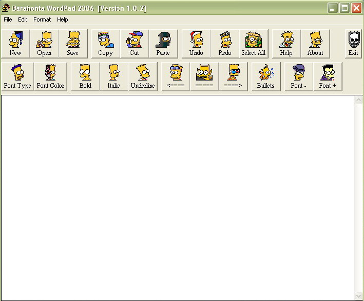



## bArAhOnTa wOrDpAd 2006

### Description

this code is basicly a wordpad like software,, it shows a lot of usefull stuff on the use of the RichText Box tool, wich is by the way really usefull in these kind of programs,,,,,, SO PLEASE POST COMMENTS AND SEND ME FEEDBACKS coz this is my first upload :-)
 
### More Info
 

             |
---                |---
**Submitted On**   |2000-03-25 13:49:28
**By**             |[bArAhOnTa](https://github.com/Planet-Source-Code/PSCIndex/blob/master/ByAuthor/barahonta.md)
**Level**          |Intermediate
**User Rating**    |4.7 (14 globes from 3 users)
**Compatibility**  |VB 3\.0, VB 4\.0 \(16\-bit\), VB 4\.0 \(32\-bit\), VB 5\.0, VB 6\.0, VB Script, ASP \(Active Server Pages\) , VBA MS Access, VBA MS Excel
**Category**       |[String Manipulation](https://github.com/Planet-Source-Code/PSCIndex/blob/master/ByCategory/string-manipulation__1-5.md)
**World**          |[Visual Basic](https://github.com/Planet-Source-Code/PSCIndex/blob/master/ByWorld/visual-basic.md)
**Archive File**   |[bArAhOnTa\_1983873292006\.zip](https://github.com/Planet-Source-Code/barahonta-barahonta-wordpad-2006__1-64844/archive/master.zip)

